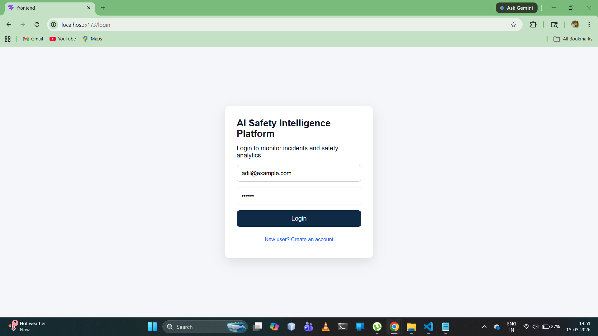
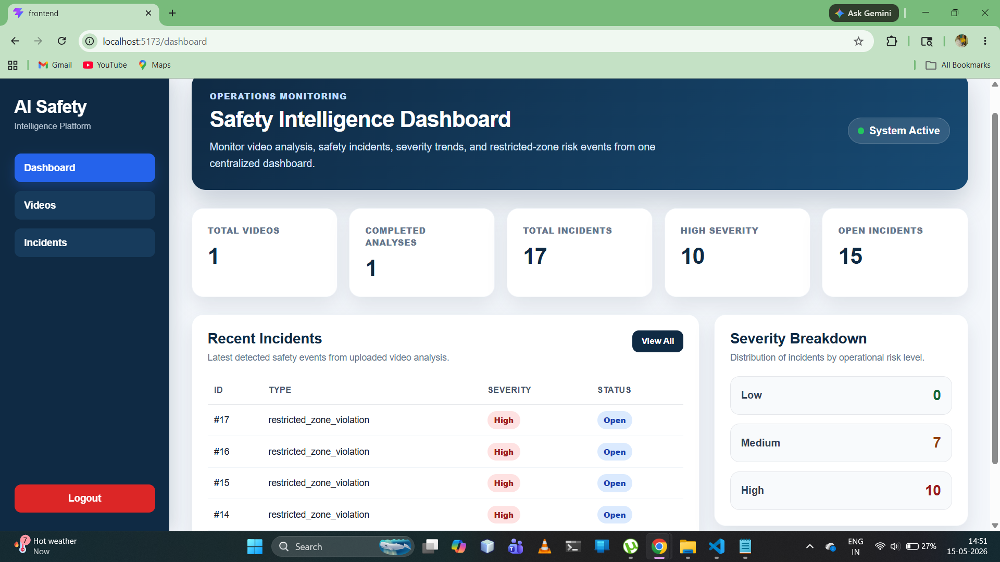
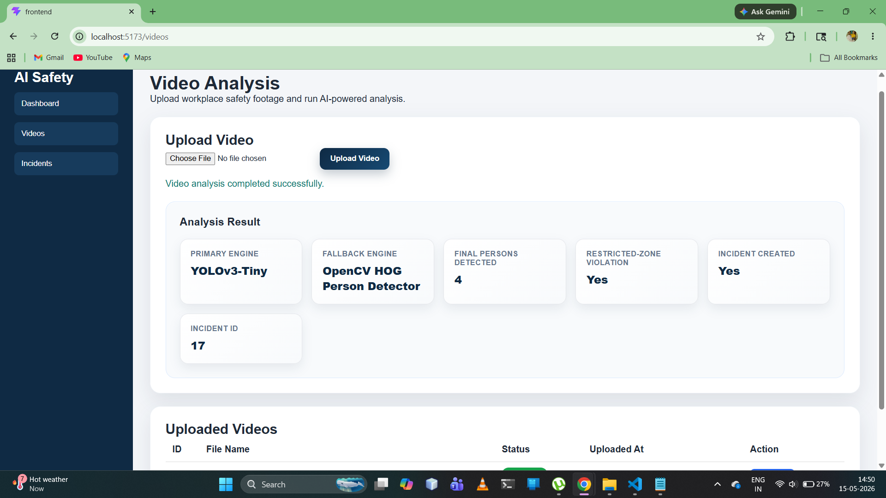
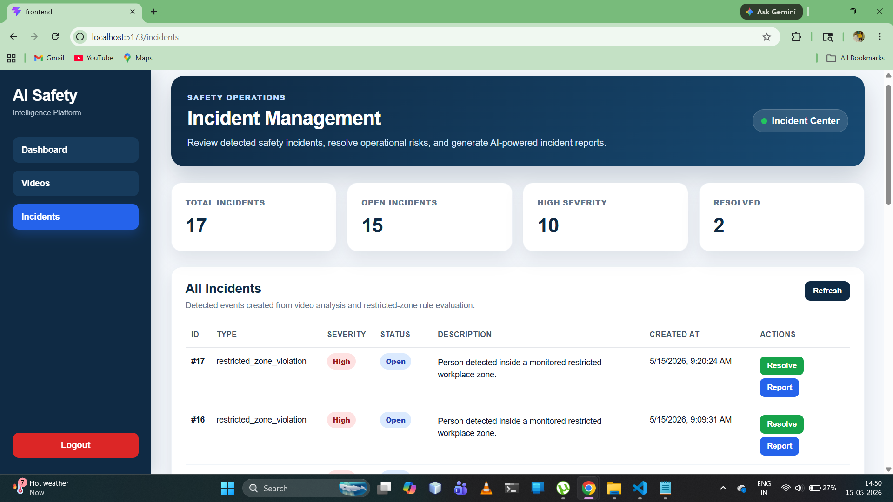
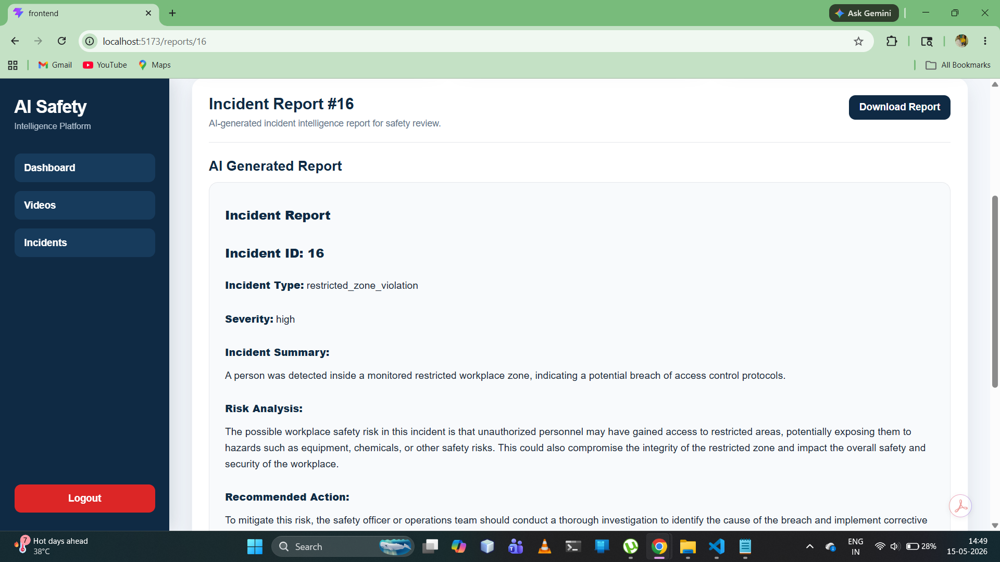

# AI-Powered Real-Time Safety Intelligence Platform

A production-style AI safety monitoring platform that analyzes uploaded workplace videos, detects safety incidents, creates restricted-zone violation records, and generates AI-powered incident reports using Groq API.

This project is designed for workplaces, campuses, warehouses, factories, and restricted operational areas where safety teams need a faster way to review incidents from uploaded video footage.

---

## Live Demo

- Frontend: `Add your Vercel frontend link here`
- Backend API: `https://ai-safety-intelligence-platform.onrender.com`
- API Docs: `https://ai-safety-intelligence-platform.onrender.com/docs`

---

## Project Overview

The AI-Powered Real-Time Safety Intelligence Platform allows users to upload workplace safety footage and automatically analyze it using computer vision.

The system extracts video metadata, samples frames, runs object/person detection, evaluates restricted-zone violations, stores incidents in PostgreSQL, and generates AI-based incident reports using Groq API.

The platform includes a React dashboard for monitoring videos, incidents, severity levels, recent events, restricted-zone violations, and downloadable reports.

---

## Problem Statement

Safety teams often need to manually review CCTV or workplace footage to identify restricted-zone violations, unsafe presence, or operational risks. Manual review is time-consuming and may delay response.

This platform helps automate the first level of incident detection and reporting by combining:

- Video processing
- Computer vision detection
- Database-driven restricted-zone logic
- Role-based incident workflows
- Incident management
- AI-generated safety reports

---

## Features

### Authentication and Authorization

- User registration
- User login
- JWT-based authentication
- Protected backend APIs
- Role-based access control
- Admin, Safety Officer, and Viewer roles

### Role-Based Access Control

The platform supports three user roles:

- `admin`
- `safety_officer`
- `viewer`

Role permissions:

- Admin can access all major operations.
- Safety Officer can upload videos, analyze videos, resolve incidents, and generate reports.
- Viewer can view dashboard, videos, incidents, and reports, but cannot perform restricted actions.

Protected actions include:

- Uploading videos
- Analyzing videos
- Resolving incidents
- Generating AI reports

### Video Analysis

- Upload workplace safety videos
- Store uploaded video metadata
- Extract video details such as FPS, duration, total frames, and resolution
- Extract sample frames from uploaded videos
- Save extracted frames for analysis
- Analyze uploaded videos using a hybrid detection pipeline

### AI / Computer Vision Pipeline

- YOLOv3-Tiny object detection using OpenCV DNN
- OpenCV HOG fallback person detection
- Hybrid detection summary
- Database-driven restricted-zone configuration
- User-defined restricted zones
- Restricted-zone rule engine
- High-severity incident creation based on detection results

### Restricted Zone Management

- Create restricted zones using backend API
- Store zone coordinates in PostgreSQL
- Maintain active restricted zones per user
- Use active database zone during video analysis
- Fall back to default zone if no active zone is available

Restricted zone data includes:

- Zone name
- X coordinate
- Y coordinate
- Width
- Height
- Active status

### Incident Management

- View all detected incidents
- Track incident severity
- Track incident status
- Resolve open incidents
- Generate AI reports for incidents

### Dashboard Analytics

- Total uploaded videos
- Completed analyses
- Total incidents
- High-severity incidents
- Open incidents
- Recent incidents
- Severity breakdown

### AI Incident Reports

- Groq API integration
- Professional AI-generated safety reports
- Risk analysis
- Recommended actions
- Downloadable TXT reports
- Downloadable PDF reports using browser print/save flow

### Deployment

- Backend deployed on Render
- Frontend deployed on Vercel
- PostgreSQL database hosted on Neon
- Environment variables used for production secrets
- Docker configuration added for future containerized setup

---

## Tech Stack

### Frontend

- React.js
- Vite
- Axios
- React Router
- HTML
- CSS
- JavaScript
- Vercel

### Backend

- FastAPI
- Python
- SQLAlchemy
- JWT Authentication
- OpenCV
- YOLOv3-Tiny with OpenCV DNN
- Groq API
- Render

### Database

- PostgreSQL
- Neon PostgreSQL

### Tools

- Swagger UI for API testing
- pgAdmin for database management
- Git and GitHub
- Docker
- Docker Compose

---

## Project Modules

- Authentication Module
- Role-Based Access Control Module
- Video Upload Module
- Video Analysis Module
- Restricted Zone Module
- Incident Management Module
- Dashboard Analytics Module
- AI Report Generation Module
- Deployment Configuration Module

---

## System Architecture

```text
React Frontend
      ↓
Axios API Requests
      ↓
FastAPI Backend
      ↓
JWT Authentication + Role-Based Access Control
      ↓
PostgreSQL Database
      ↓
OpenCV Video Processing
      ↓
YOLOv3-Tiny Object Detection
      ↓
OpenCV HOG Fallback Detection
      ↓
Database-Driven Restricted-Zone Rule Engine
      ↓
Incident Creation
      ↓
Groq AI Report Generation
      ↓
Dashboard + Report Download
```

---

## AI Detection Pipeline

```text
Upload Video
      ↓
Store Video File
      ↓
Extract Video Metadata
      ↓
Extract Sample Frames
      ↓
Run YOLOv3-Tiny Detection
      ↓
Run OpenCV HOG Fallback Detection
      ↓
Fetch Active Restricted Zone From Database
      ↓
Evaluate Restricted-Zone Rule
      ↓
Create Safety Incident
      ↓
Generate AI Incident Report
      ↓
Display on Dashboard
```

---

## Role Permission Flow

```text
User Login
      ↓
JWT Token Generated
      ↓
Token Contains User Role
      ↓
Protected API Checks Role
      ↓
Allowed Roles Continue
      ↓
Unauthorized Roles Receive 403 Forbidden
```

---

## Database Modules

The system uses PostgreSQL with the following main entities:

- Users
- Videos
- Incidents
- Incident Reports
- Restricted Zones

### Users

Stores registered user details, authentication-related information, and role information.

### Videos

Stores uploaded video file name, file path, upload status, user ID, and upload timestamp.

### Incidents

Stores incident type, severity, description, confidence score, status, video ID, user ID, and creation timestamp.

### Incident Reports

Stores AI-generated report summary, risk analysis, recommended action, user ID, incident ID, and report creation timestamp.

### Restricted Zones

Stores user-defined restricted-zone details such as zone name, x coordinate, y coordinate, width, height, active status, user ID, and creation timestamp.

---

## API Modules

### Authentication APIs

- `POST /auth/register`
- `POST /auth/login`
- `GET /auth/me`

### Video APIs

- `POST /videos/upload`
- `GET /videos/`
- `POST /videos/{video_id}/analyze`

### Incident APIs

- `GET /incidents/`
- `POST /incidents/`
- `PATCH /incidents/{incident_id}/resolve`

### Dashboard APIs

- `GET /dashboard/summary`
- `GET /dashboard/recent-incidents`
- `GET /dashboard/severity-breakdown`
- `GET /dashboard/incident-trends`

### Report APIs

- `POST /reports/incidents/{incident_id}/generate`
- `GET /reports/incidents/{incident_id}`

### Restricted Zone APIs

- `POST /zones/`
- `GET /zones/`
- `GET /zones/active`

---

## Frontend Pages

- Login Page
- Register Page
- Dashboard Page
- Video Analysis Page
- Incident Management Page
- AI Incident Report Page

---

## Screenshots

### Login Page



### Dashboard



### Video Analysis



### Incident Management



### AI Incident Report



---

## Local Setup

### 1. Clone the Repository

```bash
git clone <your-repository-url>
cd AI-Safety-Intelligence-Platform
```

---

## Backend Setup

Go to the backend folder:

```bash
cd backend
```

Create and activate virtual environment:

```bash
python -m venv venv
venv\Scripts\activate
```

Install dependencies:

```bash
pip install -r requirements.txt
```

Create a `.env` file inside the `backend` folder:

```env
APP_NAME=AI Safety Intelligence Platform
APP_VERSION=1.0.0
DATABASE_URL=your_postgresql_database_url
SECRET_KEY=your_secret_key_here
GROQ_API_KEY=your_groq_api_key_here
```

Run the backend server:

```bash
python -m uvicorn main:app --reload
```

Backend runs at:

```text
http://127.0.0.1:8000
```

Swagger API documentation:

```text
http://127.0.0.1:8000/docs
```

---

## Frontend Setup

Go to the frontend folder:

```bash
cd frontend
```

Install dependencies:

```bash
npm install
```

Run frontend:

```bash
npm run dev
```

Frontend runs at:

```text
http://localhost:5173
```

---

## YOLO Model Setup

Create this folder:

```text
backend/models/yolo/
```

Place these files inside:

```text
coco.names
yolov3-tiny.cfg
yolov3-tiny.weights
```

Expected folder structure:

```text
backend/
└── models/
    └── yolo/
        ├── coco.names
        ├── yolov3-tiny.cfg
        └── yolov3-tiny.weights
```

---

## Docker Setup

Docker configuration files are included for backend, frontend, and Docker Compose.

Files included:

```text
backend/Dockerfile
backend/.dockerignore
frontend/Dockerfile
frontend/.dockerignore
docker-compose.yml
```

To run with Docker Compose after installing Docker Desktop:

```bash
docker compose up --build
```

---

## Environment Variables

### Backend Environment Variables

```env
APP_NAME=AI Safety Intelligence Platform
APP_VERSION=1.0.0
DATABASE_URL=your_postgresql_database_url
SECRET_KEY=your_secret_key_here
GROQ_API_KEY=your_groq_api_key_here
```

### Frontend Environment Variables

```env
VITE_API_BASE_URL=your_backend_api_url
```

---

## Project Workflow

1. User registers or logs in.
2. User receives JWT token with role information.
3. Admin or Safety Officer uploads a workplace safety video.
4. Backend stores the uploaded video.
5. OpenCV extracts video metadata such as FPS, duration, resolution, and total frames.
6. Frames are sampled and saved.
7. YOLOv3-Tiny checks for object detections.
8. OpenCV HOG works as fallback person detection.
9. Backend fetches active restricted-zone configuration from PostgreSQL.
10. Restricted-zone rule engine evaluates possible safety violation.
11. Incident is created and stored in PostgreSQL.
12. Groq API generates AI incident report.
13. User views dashboard, incidents, reports, and downloads reports.

---

## Advanced Highlights

- Modular FastAPI backend architecture
- JWT-secured protected routes
- Role-based access control
- PostgreSQL relational database design
- Database-driven restricted-zone configuration
- Hybrid computer vision detection pipeline
- YOLOv3-Tiny integration using OpenCV DNN
- OpenCV HOG fallback detection
- Restricted-zone rule engine
- AI report generation using Groq API
- TXT and PDF report download options
- React dashboard with operational analytics
- Docker configuration
- Backend deployed on Render
- Frontend deployed on Vercel
- PostgreSQL database hosted on Neon

---

## Future Improvements

- Add live webcam monitoring
- Add WebSocket-based real-time alerts
- Add user-defined restricted zones from frontend UI
- Add YOLOv8 support with newer Python environment
- Add fire and smoke detection model
- Add automated backend tests using Pytest
- Add advanced admin panel for managing users and roles

---

## Resume Highlights

- Built and deployed an AI-powered workplace safety intelligence platform using FastAPI, React.js, PostgreSQL, OpenCV, YOLOv3-Tiny, Groq API, Render, Vercel, and Neon.
- Developed a hybrid computer vision pipeline that extracts video metadata, samples frames using OpenCV, runs YOLOv3-Tiny object detection, applies OpenCV HOG fallback detection, and creates incidents based on restricted-zone rule evaluation.
- Implemented role-based access control with Admin, Safety Officer, and Viewer roles to protect upload, analysis, incident resolution, and AI report generation workflows.
- Added database-driven restricted-zone configuration, allowing video analysis to use active restricted-zone coordinates stored in PostgreSQL.
- Integrated Groq API to generate professional AI-based incident reports with risk analysis, recommended actions, incident summaries, and downloadable TXT/PDF report output.
- Designed and deployed a React dashboard with JWT authentication, video upload/analysis workflow, incident resolution, severity breakdown, recent incidents, and AI report viewing.

---

## Project Status

MVP completed with advanced AI pipeline and deployment upgrades.

Current version includes:

- Full-stack frontend and backend
- Authentication
- Role-based access control
- Video upload
- Computer vision pipeline
- Hybrid detection engine
- Database-driven restricted-zone rule engine
- Incident management
- Groq AI reports
- TXT/PDF report downloads
- Docker configuration
- Render backend deployment
- Vercel frontend deployment
- Neon PostgreSQL database
- Dashboard analytics